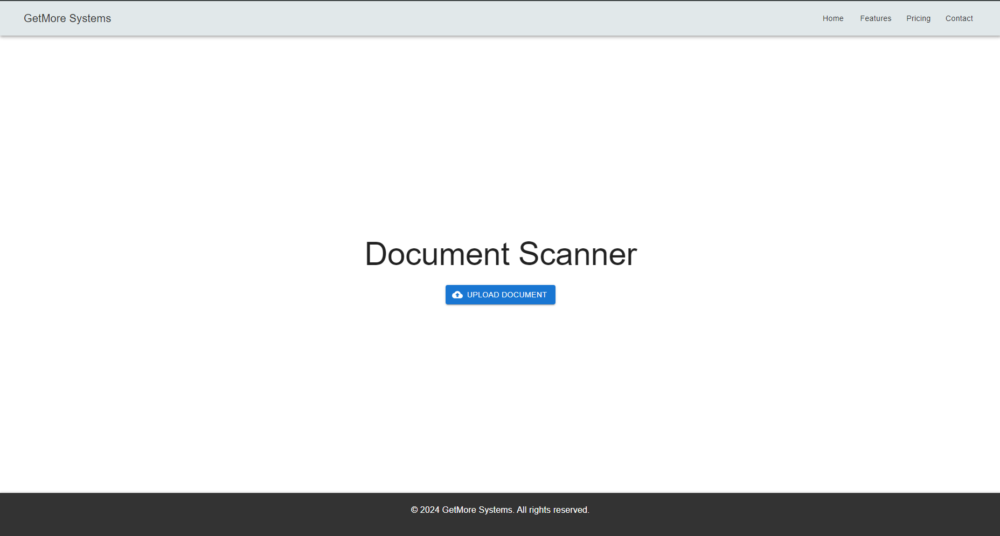

# Document Scanner

Document Scanner is a web application that allows users to upload and scan documents. The application is built using React for the frontend and .NET for the backend.

#### Project Image


## Table of Contents

- [Installation](#installation)
- [Usage](#usage)
- [Features](#features)
- [Contributing](#contributing)
- [License](#license)

## Installation

To install the project, follow these steps:

1. Clone the repository: 
```sh
`git clone https://github.com/Lossttt/docscan`
```

2. Navigate to the ClientApp directory and install the dependencies: 
```sh
cd document_scanner/ClientApp`
npm install`
```

3. In a new terminal, navigate to the document_scanner directory and run the .NET application:
```sh
cd document_scanner
dotnet run
```

## Features
 Document upload: Users can upload documents in various formats for scanning.
- Document validation: The application validates the format of the uploaded documents.
- Progress tracking: Users can track the progress of the document upload.
- Error handling: The application provides feedback to the user when an error occurs during the document upload process.
- Security: The application uses `CSRF tokens` for secure file uploads, as seen in the `uploadDocument` function.
- Libraries: The application uses several libraries including `React` for the frontend, `.NET` for the backend, `Axios` for HTTP requests, `Material-UI` for the user interface, and `OpenCVSharp` for image processing tasks. OpenCVSharp is a .NET wrapper for the OpenCV library, which is a highly optimized library for computer vision tasks.

## Usage
To use the application, navigate to `https://localhost:7154` or `http://localhost:5097` in your web browser. Click the "Upload Document" button to select a document for upload. The application will validate the document format and begin the upload process. If an error occurs during the upload, a message will be displayed to the user.
